### Per base sequence content
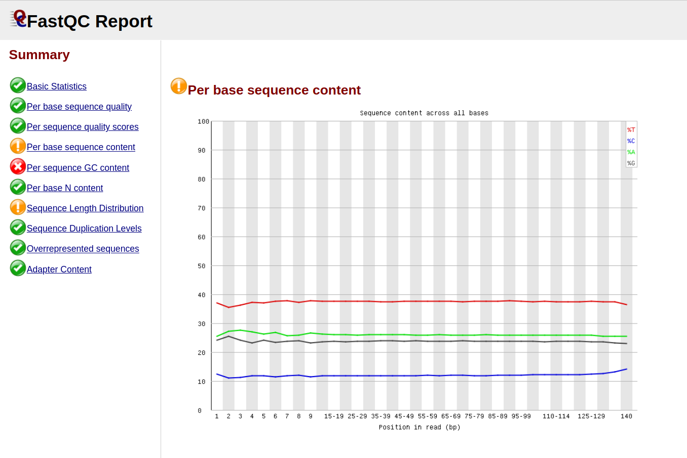
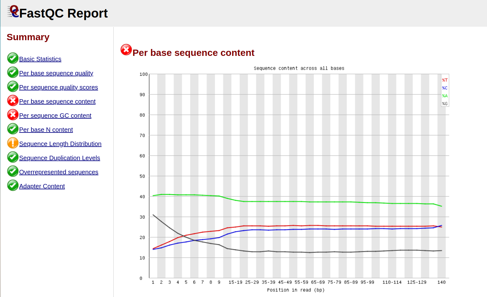
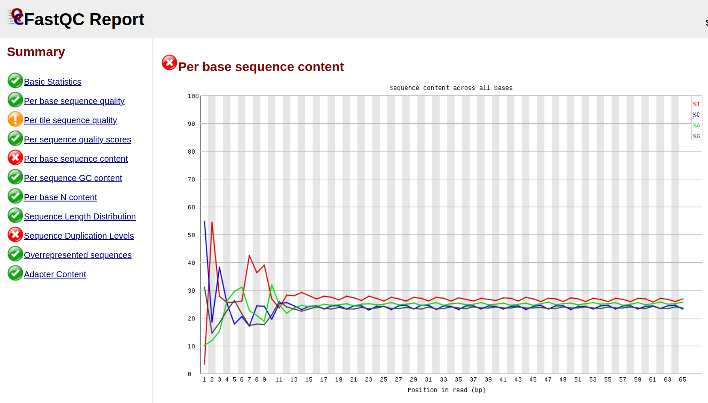

В `SRR5836473` сильно меньше цитоцина `C` чем в РНК, a тимина `T` больше. Гуанина `G` и ацетозин `А` также как в `SRR3414630`.

### Per sequence GC content
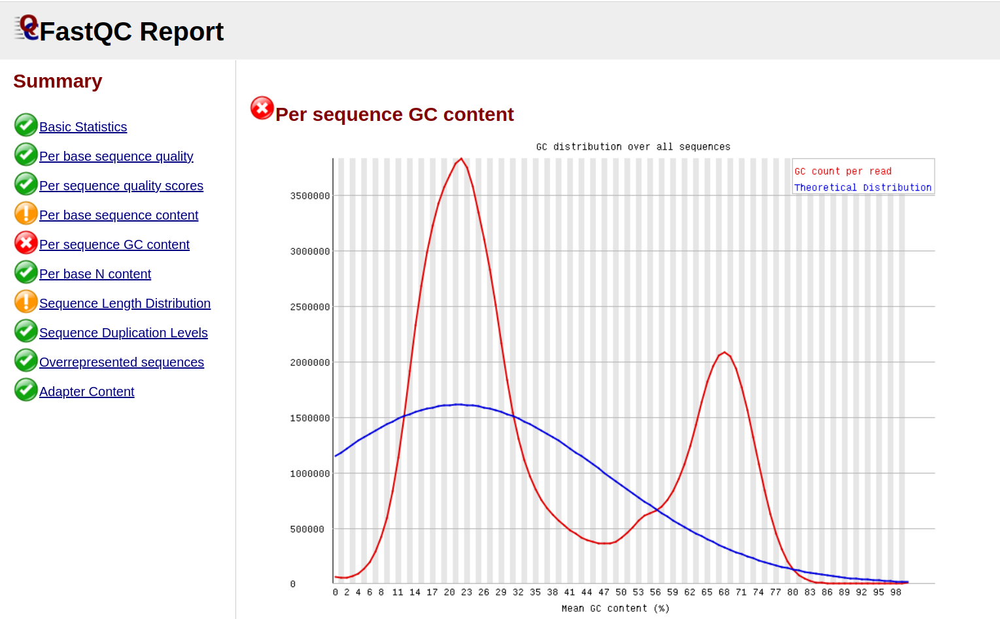
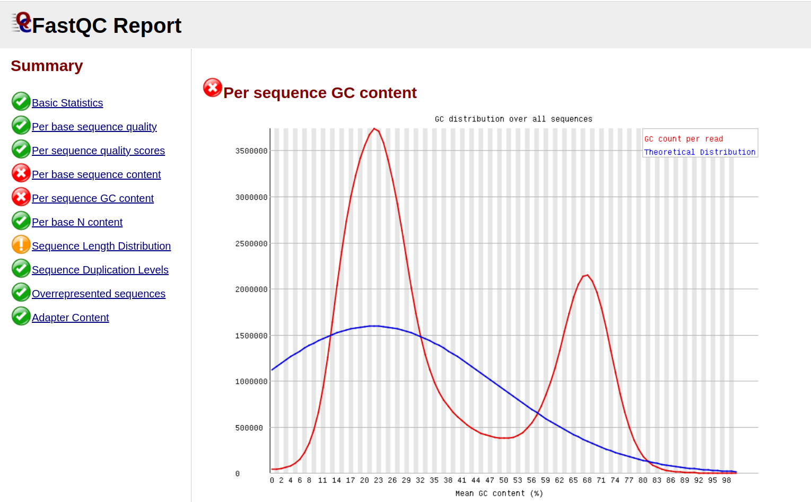
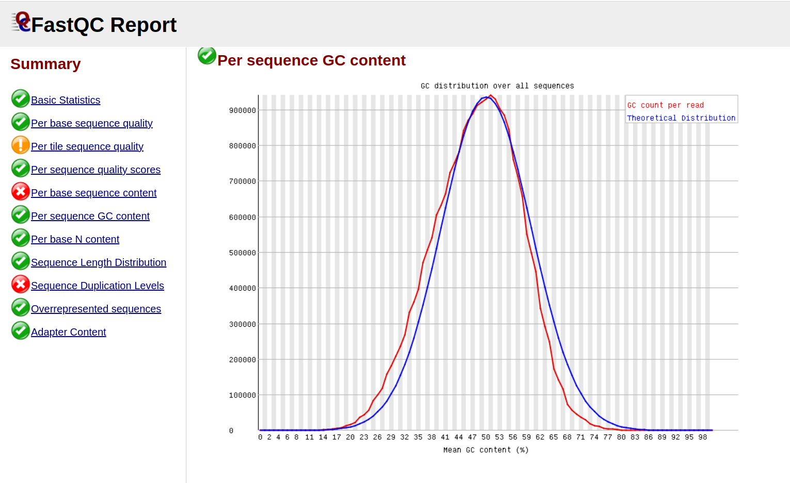

У `SRR3414630` наблюдается нормальное распределение.

### Ipynb ноутбук
[Ссылка на collab](https://colab.research.google.com/drive/1OtrDne62y65ZqK_W8Eh2KtSFT_PKb-MY?usp=sharing)

### Число ридов
BS-Seq | ch11: 11347700-11367700 | ch11: 40185800-40195800 | deduplication 
--- | --- | --- | ---
SRR5836473 | 551 | 194 | 81.72%
SRR3824222 | 1344 | 565 | 97.09%
SRR5836475 | 797 | 274 | 90.93%

### M-bias plots

Получаем уровень метилирования каждой позиции в прочтении. (По 2 графика, т.к. парно-концевая запись)

#### SRR5836473 `8 Cell`
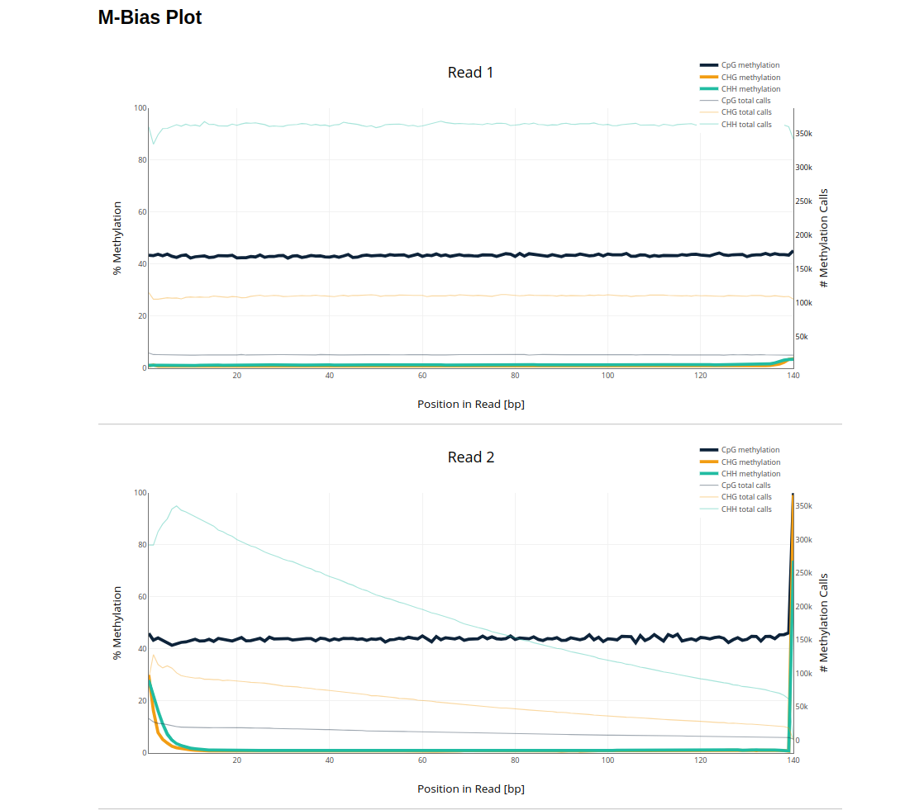

#### SRR5836475 `ICM`
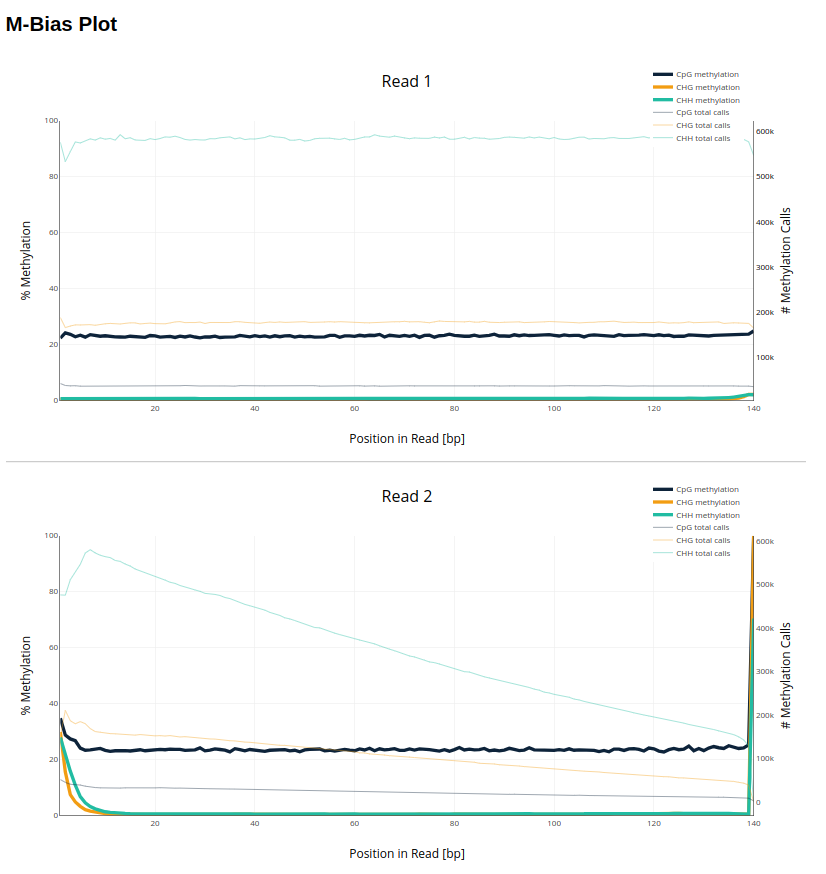

#### SRR3824222 `Epiblast`
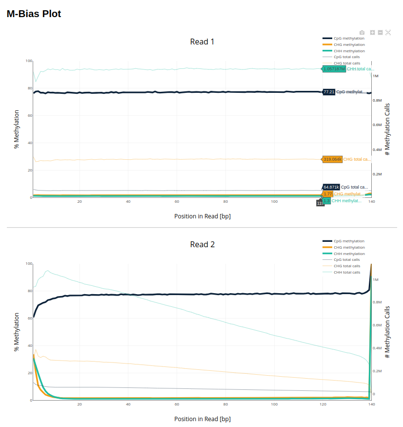

### Гистограмы распределения метелирования цитозинов по хромосоме

#### SRR5836473 `8 Cell`
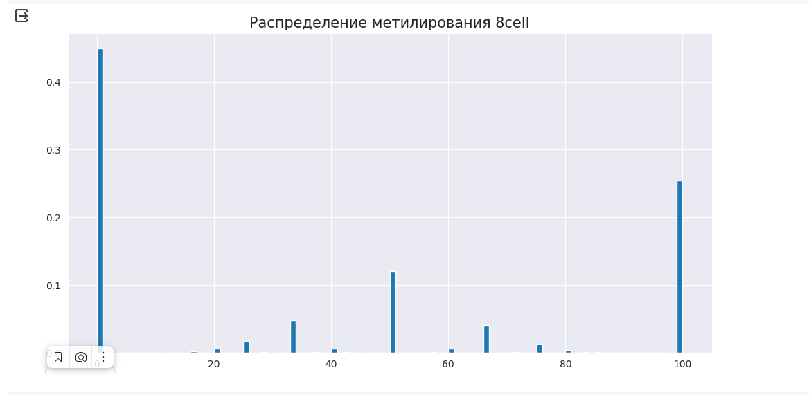

#### SRR5836475 `ICM`
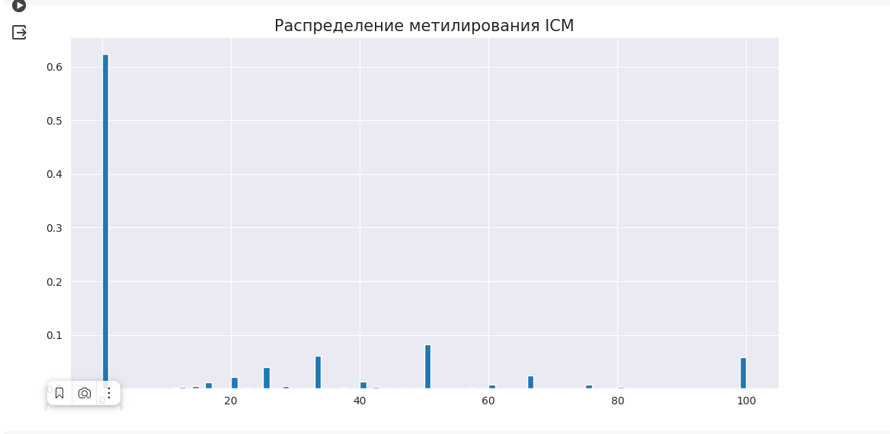

#### SRR3824222 `Epiblast`
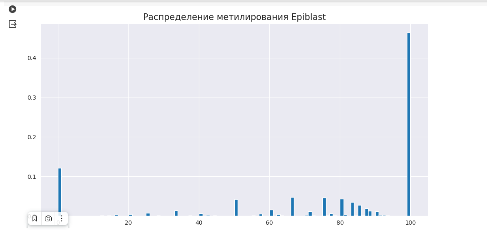

#### Вывод:
Графики разнятся: 

1. В 8cell с ~40% вероятностью метилируется 0% цитозинов.
2. В icm с ~60% вероятностью метилируется 0% цитозинов.
3. В epiblast чаще всего метилируется 100% (это хорошо, т.к. метилирование принимает участие в экспрессии гена)

### Визуализация уровня метилирования и покрытия для каждого образца

#### Уровень Покрытия
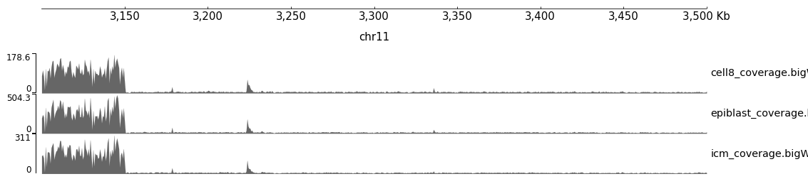

#### Уровень Метилирования
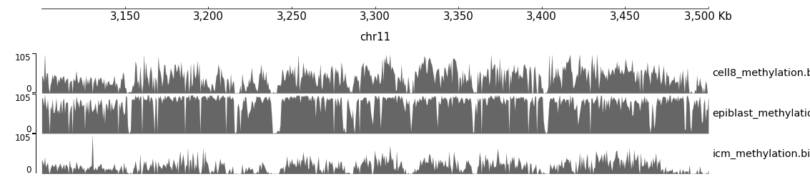
